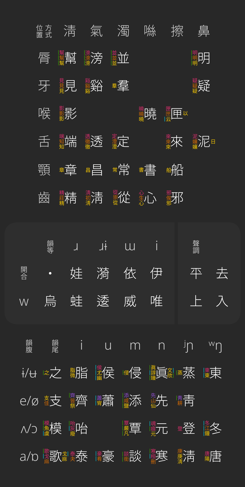

<h1>Middle Chinese Phonetics</h1>
<h3>廣韻反查</h3>
<ul><ol><li> Input characters with Cangjie or Pinyin, results automatically appear.</li>
<li> Result Format: 〖Initial〗Medial【Final】Tone</li>
<ol><li>First and fourth Deng correspond to no medial</li>
<li>Second Deng is marked by Retroflex</li>
<li>Third Deng includes Alveolar, Semi-Retroflex, Dental, before back vowel, duplicated third Deng, and duplicated fourth Deng</li></ol>
<li> Finals are categorized to those of "FLAT" tones.</li>
<li> Lip initials doesn't indicate labio-velarization</li></ol>
<ol>
<li>以倉頡或普通話拼音查詢</li>
<li>顯示格式：〖聲〗介【韻】調</li>
<ol><li>一、四等韻無介音</li>
<li>二等韻介音記爲「舌」</li>
<li>三等韻介音三分，分別接後元音、重紐三等、重紐四等</li></ol>
<li>韻母舉平以賅上去入</li>
<li>脣音無開闔</li></ol></ul>

<ol style = "display: none;"><li>
聲母Initial

<table><tr>
	<th></th><th>幫</th><th>滂</th><th>並</th><th>明</th><th>見</th><th>谿</th><th>羣</th><th>疑</th><th>影</th><th>曉</th><th>匣</th><th>端</th><th>透</th><th>定</th><th>泥</th><th>精</th><th>清</th><th>從</th><th>心</th><th>邪</th><th>章</th><th>昌</th><th>常</th><th>書</th><th>船</th><th>來</th>
</tr>
<tr>
	<th>一四等</th><td>幫</td><td>滂</td><td>並</td><td>明</td><td>見</td><td>谿</td><td></td><td>疑</td><td>影</td><td>曉</td><td>匣</td><td>端</td><td>透</td><td>定</td><td>泥</td><td>精</td><td>清</td><td>從</td><td>心</td><td>邪</td><td></td><td></td><td></td><td></td><td></td><td>來</td>
</tr>
<tr>
	<th>二等</th><td>幫</td><td>滂</td><td>並</td><td>明</td><td>見</td><td>谿</td><td></td><td>疑</td><td>影</td><td>曉</td><td>匣</td><td>知</td><td>徹</td><td>澄</td><td>孃</td><td>莊</td><td>初</td><td>崇</td><td>生</td><td>俟</td><td></td><td></td><td></td><td></td><td></td>
</tr>
<tr>
	<th>鈍音三等</th><td>幫</td><td>滂</td><td>並</td><td>明</td><td>見</td><td>谿</td><td>羣</td><td>疑</td><td>影</td><td>曉</td><td>云</td><td>知</td><td>徹</td><td>澄</td><td>孃</td><td>莊</td><td>初</td><td>崇</td><td>生</td><td>俟</td><td></td><td></td><td></td><td></td><td></td><td>來</td>
</tr>
<tr>
	<th>其它三等</th><td>非</td><td>敷</td><td>奉</td><td>微</td><td>見</td><td>谿</td><td>羣</td><td>疑</td><td>影</td><td>曉</td><td>云</td><td></td><td></td><td></td><td></td><td></td><td></td><td></td><td></td><td></td><td></td><td></td><td></td><td></td><td></td><td>來</td>
</tr>
<tr>
	<th>尖音三等</th><td>幫</td><td>滂</td><td>並</td><td>明</td><td>見</td><td>谿</td><td>羣</td><td>疑</td><td>影</td><td>曉</td><td>以</td><td></td><td></td><td></td><td>日</td><td>精</td><td>清</td><td>從</td><td>心</td><td>邪</td><td>章</td><td>昌</td><td>常</td><td>書</td><td>船</td>
</tr>
</table></li>
<li>
韻母Final

<table><tr>
	<th></th><th>東</th><th>冬</th><th>唐</th><th>蒸</th><th>登</th><th>清</th><th>青</th><th>模</th><th>侯</th><th>支</th><th>歌</th><th>之</th><th>豪</th><th>蕭</th><th>脂</th><th>咍</th><th>泰</th><th>齊</th><th>眞</th><th>元</th><th>寒</th><th>先</th><th>侵</th><th>覃</th><th>談</th><th>添</th>
</tr>
<tr>
	<th>一四等</th><td>東</td><td>冬</td><td>唐</td><td></td><td>登</td><td></td><td>青</td><td>模</td><td>侯</td><td></td><td>歌開／戈合</td><td></td><td>豪</td><td>蕭</td><td></td><td>咍開／灰合</td><td>泰</td><td>齊</td><td></td><td>痕開／魂合</td><td>寒開／桓合</td><td>先</td><td></td><td>覃</td><td>談</td><td>添</td>
</tr>
<tr>
	<th>二等</th><td></td><td>江</td><td></td><td></td><td></td><td>庚</td><td>耕</td><td></td><td></td><td>佳</td><td>麻</td><td></td><td>肴</td><td></td><td></td><td></td><td>夬</td><td>皆</td><td></td><td></td><td>刪</td><td>山</td><td></td><td></td><td>銜</td><td>咸</td>
</tr>
<tr>
	<th>鈍音三等</th><td>東</td><td>鐘</td><td>陽</td><td>蒸</td><td></td><td>清知／庚脣牙喉</td><td></td><td>魚開／虞合</td><td>尤</td><td>支</td><td>麻</td><td>之</td><td></td><td>宵</td><td>脂</td><td></td><td></td><td>祭</td><td>眞開／諄合／臻莊</td><td></td><td></td><td>仙</td><td>侵</td><td></td><td></td><td>鹽</td>
</tr>
<tr>
	<th>其它三等</th><td>東</td><td>鐘</td><td>陽</td><td></td><td></td><td></td><td></td><td>魚開／虞合</td><td>尤</td><td></td><td></td><td>之</td><td></td><td></td><td>微</td><td>廢</td><td></td><td></td><td>欣開／文合</td><td>元</td><td></td><td></td><td></td><td>嚴牙喉／凡脣</td><td></td><td></td>
</tr>
<tr>
	<th>銳音三等</th><td>東</td><td>鐘</td><td>陽</td><td>蒸</td><td></td><td>清</td><td></td><td>魚開／虞合</td><td>幽</td><td>支</td><td>麻</td><td>之</td><td></td><td>宵</td><td>脂</td><td></td><td></td><td>祭</td><td>眞開／諄合</td><td></td><td></td><td>仙</td><td>侵</td><td></td><td></td><td>鹽</td>
</tr>
</table></li>
<li>
介音Medial

<table><tr>
	<th></th><th>開</th><th>合</th>
</tr><tr>
	<th>一四等</th><td></td><td>烏</td>
</tr><tr>
	<th>二等</th><td>娃</td><td>蛙</td>
</tr><tr>
	<th>鈍音三等</th><td>漪</td><td>逶</td>
</tr><tr>
	<th>其它三等</th><td>依</td><td>威</td>
</tr><tr>
	<th>銳音三等</th><td>伊</td><td>惟</td>
</tr>
</table></li>
</ol>
